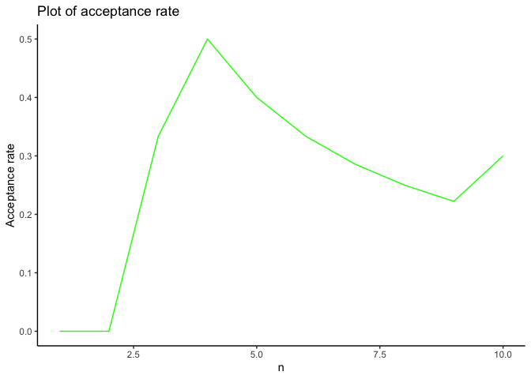
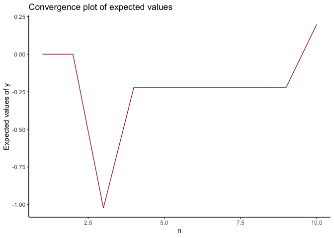
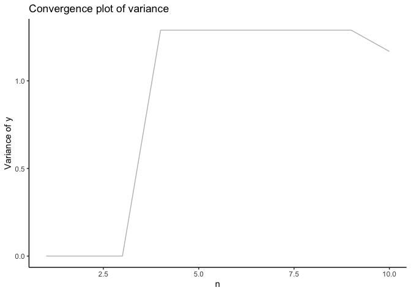

<!-- README.md is generated from README.Rmd. Please edit that file -->

# arsampler

<!-- badges: start -->

<!-- badges: end -->

## Overview

`arsampler` is a package to help perform the acceptance-rejection
sampling without having to code the entire algorithm itself. The current
version of this package (Version 1.0.0) can only accept a proposal
densities from pre-defined templates while the user can define their own
target densities (see examples below).

## Installation

You can install the released version of `arsampler` along with the unit
tests and the vignettes with:

``` r
# Install the relevant library (if not already)
install.packages("devtools")

# Load the relevant library
library(devtools)

# Install the arsampler package from GitHub
devtools::install_github("enggelin/arsampler", build_vignettes=TRUE, INSTALL_opts = "--install-tests")

# Load the arsampler package
library(arsampler)
```

## Get started with arsampler

Read the short introductory vignette to get you started with
`arsampler`. To look at examples, follow the section **Example** right
after this section.

``` r
# Read the short vignette
browseVignettes("arsampler")
vignette("introduction-to-arsampler")
```

The vignette above basically explains that the package has 4 functions:
`ar()`, which is the main function and outputs an object of class `ar`;
`ar_summary()`, which receives input of an object of class `ar` or
`ar_conv` and outputs the summary of the acceptance-rejection sampling;
`ar_plot()`, which receives input of an object of class `ar` or
`ar_conv` and outputs the overlay plot of both the target and proposal
densities (scaled with `c`, if defined) in a single plot (for object
`ar`) or convergence plots (for object `ar_conv`); and `ar_conv`, which
receives input of an object of class `ar` and outputs an object of class
`ar_conv`, which contains transformed data from object `ar` for
convergence diagnostic purposes.

## Example

This is a basic example of the usage of `arsampler` package:

``` r
library(arsampler)

# Target density: Normal(0,1); Proposal density: Normal(0,1)
f_norm <- "(1/sqrt(2*pi*1^2))*exp((-(x-0)^2)/(2*1^2))"
q_unif <- "runif(n, -4, 4)"

# Run the main function ar()
example_norm_unif <- ar(f_norm, q_unif, c=3.2, n=10)
```

``` r
# Print the raw values of the sampler
ar_print(example_norm_unif)
#> Data of  example_norm_unif :
#> 
#> $params
#> $params$f
#> [1] "(1/sqrt(2*pi*1^2))*exp((-(x-0)^2)/(2*1^2))"
#> 
#> $params$q
#> [1] "runif(n, -4, 4)"
#> 
#> $params$c
#> [1] 3.2
#> 
#> $params$n
#> [1] 10
#> 
#> 
#> $data
#>    index           x           f     q           y          r           u
#> 1      1  2.23016545 0.033181676 0.125          NA 0.08295419 0.649477553
#> 2      2 -0.53463665 0.345813140 0.125 -0.53463665 0.86453285 0.441337788
#> 3      3 -2.31113649 0.027608972 0.125 -2.31113649 0.06902243 0.004346638
#> 4      4  2.98233924 0.004672261 0.125          NA 0.01168065 0.576691087
#> 5      5  0.15781470 0.394005160 0.125  0.15781470 0.98501290 0.687093787
#> 6      6 -2.51275382 0.016976854 0.125          NA 0.04244213 0.440774988
#> 7      7  1.97478656 0.056765331 0.125  1.97478656 0.14191333 0.115812211
#> 8      8 -2.85929873 0.006692732 0.125          NA 0.01673183 0.536986188
#> 9      9 -0.06950995 0.397979672 0.125 -0.06950995 0.99494918 0.132610541
#> 10    10 -0.07057297 0.397950042 0.125 -0.07057297 0.99487510 0.852391060
#> 
#> $acceptance_rate
#> [1] 0.6
#> 
#> $expected_values_f
#> [1] -0.1422091
#> 
#> $variance_f
#> [1] 1.888069
#> 
#> $suggested_c
#> [1] "NA"
```

``` r
# Provide a summary of the sampler
ar_summary(example_norm_unif)
#> Summary of  example_norm_unif :
#> ----------------------
#>      Number of iterations:  10 
#>      Acceptance rate:  0.6 
#>      Empirical expected value of target distribution:  -0.1422 
#>      Empirical variance of target distribution:  1.8881 
#>      Suggested minimum c:  NA 
#> ----------------------
```

``` r
# Provide an overlay plot of the sampler
ar_plot(example_norm_unif)
```


The above output can also be achieved by using the commands `print()`,
`summary()`, and `plot()`, which is an S3 object-oriented method in R.
Those commands are overridden if the user passes an object of class
`ar`, which is the object class of the output from the function `ar()`.

``` r
# Print the raw values of the sampler using S3 method print()
print(example_norm_unif)
#> Data of  example_norm_unif :
#> 
#> $params
#> $params$f
#> [1] "(1/sqrt(2*pi*1^2))*exp((-(x-0)^2)/(2*1^2))"
#> 
#> $params$q
#> [1] "runif(n, -4, 4)"
#> 
#> $params$c
#> [1] 3.2
#> 
#> $params$n
#> [1] 10
#> 
#> 
#> $data
#>    index           x           f     q           y          r           u
#> 1      1  2.23016545 0.033181676 0.125          NA 0.08295419 0.649477553
#> 2      2 -0.53463665 0.345813140 0.125 -0.53463665 0.86453285 0.441337788
#> 3      3 -2.31113649 0.027608972 0.125 -2.31113649 0.06902243 0.004346638
#> 4      4  2.98233924 0.004672261 0.125          NA 0.01168065 0.576691087
#> 5      5  0.15781470 0.394005160 0.125  0.15781470 0.98501290 0.687093787
#> 6      6 -2.51275382 0.016976854 0.125          NA 0.04244213 0.440774988
#> 7      7  1.97478656 0.056765331 0.125  1.97478656 0.14191333 0.115812211
#> 8      8 -2.85929873 0.006692732 0.125          NA 0.01673183 0.536986188
#> 9      9 -0.06950995 0.397979672 0.125 -0.06950995 0.99494918 0.132610541
#> 10    10 -0.07057297 0.397950042 0.125 -0.07057297 0.99487510 0.852391060
#> 
#> $acceptance_rate
#> [1] 0.6
#> 
#> $expected_values_f
#> [1] -0.1422091
#> 
#> $variance_f
#> [1] 1.888069
#> 
#> $suggested_c
#> [1] "NA"
```

``` r
# Provide a summary of the sampler using S3 method summary()
summary(example_norm_unif)
#> Summary of  example_norm_unif :
#> ----------------------
#>      Number of iterations:  10 
#>      Acceptance rate:  0.6 
#>      Empirical expected value of target distribution:  -0.1422 
#>      Empirical variance of target distribution:  1.8881 
#>      Suggested minimum c:  NA 
#> ----------------------
```

``` r
# Provide an overlay plot of the sampler using S3 method plot()
plot(example_norm_unif)
```


The variable `example_norm_unif`, which is an object of class `ar`, can
also be passed into the function `ar_conv()`, which will create an
object of class `ar_conv` that can also be passed to the function
`ar_print()`, `ar_summary()`, and `ar_plot()`. These functions display
different outputs based on the class of the input object.

``` r
# Pass an object of class "ar" into the function "ar_conv()"
example_norm_unif_conv <- ar_conv(example_norm_unif)
```

``` r
# Print the raw values of the convergence data
ar_print(example_norm_unif_conv)
#> Convergence data of  example_norm_unif_conv :
#> 
#> $data
#>    index acceptance_rate_cumulative           y mean_cumulative var_cumulative
#> 1      1                  0.0000000          NA       0.0000000       0.000000
#> 2      2                  0.5000000 -0.53463665      -0.5346367       0.000000
#> 3      3                  0.6666667 -2.31113649      -1.4228866       1.577976
#> 4      4                  0.5000000          NA      -1.4228866       1.577976
#> 5      5                  0.6000000  0.15781470      -0.8959861       1.621860
#> 6      6                  0.5000000          NA      -0.8959861       1.621860
#> 7      7                  0.5714286  1.97478656      -0.1782930       3.141574
#> 8      8                  0.5000000          NA      -0.1782930       3.141574
#> 9      9                  0.5555556 -0.06950995      -0.1565364       2.358547
#> 10    10                  0.6000000 -0.07057297      -0.1422091       1.888069
```

``` r
# Provide a summary of the convergence data
ar_summary(example_norm_unif_conv)
#> Convergence summary of  example_norm_unif_conv :
#> ----------------------
#>      Acceptance rate:  0.6 
#>      Empirical expected value of target distribution:  -0.1422 
#>      Empirical variance of target distribution:  1.8881 
#> ----------------------
```

``` r
# Provide convergence plots of the convergence data
ar_plot(example_norm_unif_conv)
```



## Test plan: unit testing

In this version, we will test several scenarios involving varieties of
pairs of target densities and pre-defined proposal densities and how
they will perform.

The unit tests can be run directly from the tests folder obtained when
installing the package. There are one test file in the tests folder,
which is used to test the main function of this package, `ar()`.

To run the unit tests from the tests folder, run the following command:

``` r
# Install the relevant library (if not already)
install.package("testthat")

# Load the relevant library
library(testthat)

# Set the working directory to the package root, and run this command:
testthat::test_dir(system.file("tests/testthat", package = "arsampler"))
```

The above command will test several scenarios defined by the author of
this package. The unit testing comprises of several scenario which may
arise in certain circumstances and the expected output from it. Inside
the directory `tests/testthat/`, there are five test files named
`test-ar_conv.R`, `test-ar_plot.R`, `test-ar_print.R`,
`test-ar_summary.R`, and `test-ar.R`. The contents of the test files and
the context of the tests are explained below:

### Test file 1. `test-ar_conv.R`

The first test file, `test-ar_conv.R`, test whether the input to the
function `ar_conv()` is an object of class `ar`, thus a valid input.
Other invalid inputs, such as object of class `string` or `numeric` will
not be accepted and results in the error message:
`Input must be an object of class "ar".`. The content of the test file
is as follows:

``` r
# test-ar_conv.R

test_that("Test of the input of the function ar_conv().", {

  # expect error
  expect_error(ar_conv("A"), "Input must be an object of class \"ar\".")
  expect_error(ar_conv(1), "Input must be an object of class \"ar\".")
  expect_error(ar_conv(c(1,2,3)), "Input must be an object of class \"ar\".")
})
```

### Test file 2. `test-ar_plot.R`

The next test file, `test-ar_plot.R`, test whether the input to the
function `ar_plot()` is an object of class `ar` or `ar_conv`, thus a
valid input. Other invalid inputs, such as object of class `string` or
`numeric` will not be accepted and results in the error message:
`Input must be an object of class "ar" or "ar_conv".`. This file also
test whether there are no errors/warnings/messages/fails and some output
exists when running the function on an object of class `ar`. The content
of the test file is as follows:

``` r
# test-ar_plot.R

test_that("Test of the input of the function ar_plot().", {

  # expect error
  expect_error(ar_plot("A"), "Input must be an object of class \"ar\" or \"ar_conv\".")
  expect_error(ar_plot(1), "Input must be an object of class \"ar\" or \"ar_conv\".")
  expect_error(ar_plot(c(1,2,3)), "Input must be an object of class \"ar\" or \"ar_conv\".")
})


test_that("Test of valid outputs of the function ar_plot().", {
  # pair of standard normal distribution and uniform distribution
  f_norm <- "(1/sqrt(2*pi*1^2))*exp((-(x-0)^2)/(2*1^2))"
  q_unif <- "runif(n, -4, 4)"
  set.seed(0)
  example_norm_unif <- ar(f_norm, q_unif, c=3.2, n=1000)
  example_norm_unif_conv <- ar_conv(example_norm_unif)

  # expect no errors/fails/messages/warning of the output of input "ar" and no errors of "ar_conv".
  expect_no_condition(ar_plot(example_norm_unif))
  expect_no_condition(plot(example_norm_unif))
})
```

### Test file 3. `test-ar_print.R`

The next test file, `test-ar_print.R`, test whether the input to the
function `ar_print()` is an object of class `ar` or `ar_conv`, thus a
valid input. Other invalid inputs, such as object of class `string` or
`numeric` will not be accepted and results in the error message:
`Input must be an object of class "ar" or "ar_conv".`. This file also
test whether there are no errors/warnings/messages/fails and some output
exists when running the function on an object of class `ar` and
`ar_conv`. The content of the test file is as follows:

``` r
# test-ar_print.R

test_that("Test of the input of the function ar_print().", {

  # expect error
  expect_error(ar_print("A"), "Input must be an object of class \"ar\" or \"ar_conv\".")
  expect_error(ar_print(1), "Input must be an object of class \"ar\" or \"ar_conv\".")
  expect_error(ar_print(c(1,2,3)), "Input must be an object of class \"ar\" or \"ar_conv\".")
})


test_that("Test of valid outputs of the function ar_print().", {
  # pair of standard normal distribution and uniform distribution
  f_norm <- "(1/sqrt(2*pi*1^2))*exp((-(x-0)^2)/(2*1^2))"
  q_unif <- "runif(n, -4, 4)"
  set.seed(0)
  example_norm_unif <- ar(f_norm, q_unif, c=3.2, n=1000)
  example_norm_unif_conv <- ar_conv(example_norm_unif)

  # expect no errors/fails/messages/warning of the output of input "ar".
  expect_no_condition(ar_print(example_norm_unif))
  expect_no_condition(print(example_norm_unif))

  # expect no errors/fails/messages/warning of the output of input "ar_conv".
  expect_no_condition(print(example_norm_unif_conv))
  expect_no_condition(ar_print(example_norm_unif_conv))
})
```

### Test file 4. `test-ar_summary.R`

The test file `test-ar_summary.R` tests whether the input to the
function `ar_summary()` is an object of class `ar` or `ar_conv`, thus a
valid input. Other invalid inputs, such as object of class `string` or
`numeric` will not be accepted and results in the error message:
`Input must be an object of class "ar" or "ar_conv".`. This file also
test whether there are no errors/warnings/messages/fails and some output
exists when running the function on an object of class `ar` and
`ar_conv`. The content of the test file is as follows:

``` r
# test-ar_summary.R

test_that("Test of the input of the function ar_summary().", {

  # expect error
  expect_error(ar_summary("A"), "Input must be an object of class \"ar\" or \"ar_conv\".")
  expect_error(ar_summary(1), "Input must be an object of class \"ar\" or \"ar_conv\".")
  expect_error(ar_summary(c(1,2,3)), "Input must be an object of class \"ar\" or \"ar_conv\".")
})


test_that("Test of valid outputs of the function ar_summary().", {
  # pair of standard normal distribution and uniform distribution
  f_norm <- "(1/sqrt(2*pi*1^2))*exp((-(x-0)^2)/(2*1^2))"
  q_unif <- "runif(n, -4, 4)"
  set.seed(0)
  example_norm_unif <- ar(f_norm, q_unif, c=3.2, n=1000)
  example_norm_unif_conv <- ar_conv(example_norm_unif)

  # expect no errors/fails/messages/warning of the output of input "ar".
  expect_no_condition(summary(example_norm_unif))
  expect_no_condition(ar_summary(example_norm_unif))

  # expect no errors/fails/messages/warning of the output of input "ar_conv".
  expect_no_condition(summary(example_norm_unif_conv))
  expect_no_condition(ar_summary(example_norm_unif_conv))
})
```

### Test file 5. `test-ar.R`

The last test file, `test-ar.R`, tests the main function, thus has the
most test items. The first part of the tests is regarding the output
from several input scenarios. Basically, if the target and proposal
distribution are of the same shape written in different form (in pdf
form for the target distribution and following the templates of the
proposal distribution) then the result should be the same. In the test
file, we expect that the output from the target and proposal densities
with the same shapes are correct and hence does not return any error
messages (tested using `expect_silent()`), the acceptance rate of the
proposal density with the same form as the target density is 1,
indicating perfect match (tested using `expect_equal()`) and the
expected value, when rounded to 1 decimal place, converges to the mean
of the distribution (also tested using `expect_equal()`), and again, for
target and proposal densities with the same shapes, the suggested
minimum c equals to `NA`, indicating the proposal envelopes the target
fully (tested using `expect_match()`, since `NA` is returned as a
string).

The second part of the test file is regarding the peer review feedback,
which is to check the value of `c` entered. The function will not accept
value of `c` if it is $\le 1$ or Inf, therefore this part of the test
checks whether the value of `c` is valid. The third part of the test
file is regarding the value of `n`. `n` needs to be $\ge 1$ and if it is
decimals (but still $\ge 1$) it will be rounded mathematically.

The fourth and the final part of the tests check the output of the
proposal and target distributions. Basically, if the proposal is not
found in any templates, the function will return an error. If the target
density input results in any negative or infinity values, it will also
return an error message. Below is the full content of the test file.

``` r
# test-ar.R

test_that("The test of the output for the exact same pair of target and proposal densities.", {

  ## initialise variables for testing
  # pair of standard normal distributions
  f_norm <- "(1/sqrt(2*pi*1^2))*exp((-(x-0)^2)/(2*1^2))"
  q_norm <- "rnorm(n, 0, 1)"

  # pair of uniform distribution
  f_unif <- "1"
  q_unif <- "runif(n, 0, 1)"

  # pair of gamma distribution, alpha=3, beta=2
  f_gamma <- "((2^3)/(gamma(3)))*x^(3-1)*exp(-2*x)"
  q_gamma <- "rgamma(n, 3, 2)"

  # pair of beta distribution, alpha=3, beta=2
  f_beta <- "((gamma(3+2))/gamma(3)*gamma(2))*x^(3-1)*(1-x)^(2-1)"
  q_beta <- "rbeta(n, 3, 2)"

  # pair of exp distribution, lambda=3
  f_exp <- "3*exp(-3*x)"
  q_exp <- "rexp(n, 3)"

  # expect silent (correct input)
  expect_silent(ar(f_norm, q_norm, c=1, n=1000))
  expect_silent(ar(f_unif, q_unif, c=1, n=1000))
  expect_silent(ar(f_gamma, q_gamma, c=1, n=1000))
  expect_silent(ar(f_beta, q_beta, c=1, n=1000))
  expect_silent(ar(f_exp, q_exp, c=1, n=1000))

  # expect equal: acceptance rate = 1
  expect_equal(ar(f_norm, q_norm, c=1, n=1000)$acceptance_rate, 1)
  expect_equal(ar(f_unif, q_unif, c=1, n=1000)$acceptance_rate, 1)
  expect_equal(ar(f_gamma, q_gamma, c=1, n=1000)$acceptance_rate, 1)
  expect_equal(ar(f_beta, q_beta, c=1, n=1000)$acceptance_rate, 1)
  expect_equal(ar(f_exp, q_exp, c=1, n=1000)$acceptance_rate, 1)

  # expect equal: rounded mean from standard distributions; longer run for convergence
  expect_equal(abs(round(ar(f_norm, q_norm, c=1, n=10000)$expected_values_f, 1)), 0) # need to put abs() on the standard normal distribution because the possible value may range from negative around zero to positive around zero.
  expect_equal(round(ar(f_unif, q_unif, c=1, n=10000)$expected_values_f, 1), 0.5)
  expect_equal(round(ar(f_gamma, q_gamma, c=1, n=10000)$expected_values_f, 1), 1.5)
  expect_equal(round(ar(f_beta, q_beta, c=1, n=10000)$expected_values_f, 1), 0.6)
  expect_equal(round(ar(f_exp, q_exp, c=1, n=10000)$expected_values_f, 1), 0.3)

  # expect match: suggested c = NA
  expect_match(ar(f_norm, q_norm, c=1, n=1000)$suggested_c, "NA")
  expect_match(ar(f_unif, q_unif, c=1, n=1000)$suggested_c, "NA")
  expect_match(ar(f_gamma, q_gamma, c=1, n=1000)$suggested_c, "NA")
  expect_match(ar(f_beta, q_beta, c=1, n=1000)$suggested_c, "NA")
  expect_match(ar(f_exp, q_exp, c=1, n=1000)$suggested_c, "NA")
})


test_that("Test of the values of c (feedback from peer review).", {
  ## initialise variables for testing
  f_norm <- "(1/sqrt(2*pi*1^2))*exp((-(x-0)^2)/(2*1^2))"
  q_norm <- "rnorm(n, 0, 1)"

  # expect error
  expect_error(ar(f_norm, q_norm, c=0), "Invalid value of c; needs to be numeric and > 1.")
  expect_error(ar(f_norm, q_norm, c=0.5), "Invalid value of c; needs to be numeric and > 1.")
  expect_error(ar(f_norm, q_norm, c=Inf), "Invalid value of c; needs to be numeric and > 1.")
  expect_error(ar(f_norm, q_norm, c=-Inf), "Invalid value of c; needs to be numeric and > 1.")
})


test_that("Test of the valid values of n.", {
  ## initialise variables for testing
  f_norm <- "(1/sqrt(2*pi*1^2))*exp((-(x-0)^2)/(2*1^2))"
  q_norm <- "rnorm(n, 0, 1)"

  # expect error
  expect_error(ar(f_norm, q_norm, c=1, n=0), "n has to be an integer of minimum value of 1.")
  expect_error(ar(f_norm, q_norm, c=1, n=0.5), "n has to be an integer of minimum value of 1.")

  # expect silent
  expect_silent(ar(f_norm, q_norm, c=1, n=1.5)) # decimal values converted to the nearest rounding
})


test_that("Test whether the proposal templates is valid or not valid",{
  ## initialise variables for testing
  f_norm <- "(1/sqrt(2*pi*1^2))*exp((-(x-0)^2)/(2*1^2))"
  q_norm <- "rnorm(n, 0, 1)"
  q_norm_wrong <- "rnor(n,0,1)"

  # expect silent (proposal is valid)
  expect_silent(ar(f_norm, q_norm))

  # expect error (proposal is wrong)
  expect_error(ar(f_norm, q_norm_wrong), "Cannot find density function for rnor")
})


test_that("Test whether the target distribution is invalid (returns negative values or infinity).", {
  ## initialise variables for testing
  f_wrong <- "x+(x^2)"
  q_norm <- "rnorm(n, 0, 1)"

  # expect error (proposal is wrong)
  expect_error(ar(f_wrong, q_norm), "Target density generated infinite or negative values. Check your expression and parameters.")
})
```

If all the test files run successfully, the console will return `52`
passed test items in total, with `3` items from `test-ar_conv.R` file,
`5` items from `test-ar_plot.R` file, `7` items from `test-ar_print.R`
file, `7` items from `test-ar_summary.R` file, and the remaining 30
items from `test-ar.R` file.

The content tested by the test file can also be carried out by the user
using the instruction on the step **Test plan: user input**.

### Modified test plan based on feedback from peer review

The feedback from peer review indicates that the value of `c`, when
entered, is not checked. As a result, user can enter `c` values as
$\le 1$ or Inf without getting any error messages. This problem has
since been addressed and the test is included in the file `test-ar.R`,
in this following lines:

``` r
# test-ar.R

test_that("Test of the values of c (feedback from peer review).", {
  ## initialise variables for testing
  f_norm <- "(1/sqrt(2*pi*1^2))*exp((-(x-0)^2)/(2*1^2))"
  q_norm <- "rnorm(n, 0, 1)"

  # expect error
  expect_error(ar(f_norm, q_norm, c=0), "Invalid value of c; needs to be numeric and > 1.")
  expect_error(ar(f_norm, q_norm, c=0.5), "Invalid value of c; needs to be numeric and > 1.")
  expect_error(ar(f_norm, q_norm, c=Inf), "Invalid value of c; needs to be numeric and > 1.")
  expect_error(ar(f_norm, q_norm, c=-Inf), "Invalid value of c; needs to be numeric and > 1.")
})
```

## Test plan: user input

Besides testing using the unit tests embedded in the installed package,
user can also perform relevant testings by their own using their own
input. You will notice that in the previous example, the expected mean
and variance are rather nonsense, as we only run the sampler for a few
iterations. To be able to provide a rather accurate results, we need to
run the sampler long enough. An iteration of minimum of `n=1000` should
provide suffice (this is also the default value for `n`), although for
more mismatched target and proposal densities, it needs to be run long
enough to obtain valid samples. In this test plan, we will try several
scenarios of combination pair of target-proposal densities.

### Test 1: Proposal densities with Acceptance rate: 1, Suggested minimum c: NA, and Empirical expected value of target distribution $\approx$ its mean

The package has several pre-defined probability densities for user to
use. They are: `normal`, `uniform`, `gamma`, `beta`, and `exponential`.
To check whether this proposal densities give the correct output for its
counterpart target densities written in its pdf form, you can run these
tests below (notice that we will run it for longer iterations,
i.e. `n=1000` and no parameters declaration are done as instructed in
the vignette):

``` r
# pair of standard normal distributions
f_norm <- "(1/sqrt(2*pi*1^2))*exp((-(x-0)^2)/(2*1^2))"
q_norm <- "rnorm(n, 0, 1)"

example_norm <- ar(f_norm, q_norm, c=1, n=1000)
summary(example_norm)
#> Summary of  example_norm :
#> ----------------------
#>      Number of iterations:  1000 
#>      Acceptance rate:  1 
#>      Empirical expected value of target distribution:  0.0393 
#>      Empirical variance of target distribution:  1.0593 
#>      Suggested minimum c:  NA 
#> ----------------------
```

``` r
# pair of uniform distributions
f_unif <- "1"
q_unif <- "runif(n, 0, 1)"

example_unif <- ar(f_unif, q_unif, c=1, n=1000)
summary(example_unif)
#> Summary of  example_unif :
#> ----------------------
#>      Number of iterations:  1000 
#>      Acceptance rate:  1 
#>      Empirical expected value of target distribution:  0.5038 
#>      Empirical variance of target distribution:  0.0777 
#>      Suggested minimum c:  NA 
#> ----------------------
```

``` r
# pair of gamma distributions, alpha=3, beta=2
f_gamma <- "((2^3)/(gamma(3)))*x^(3-1)*exp(-2*x)"
q_gamma <- "rgamma(n, 3, 2)"

example_gamma <- ar(f_gamma, q_gamma, c=1, n=1000)
summary(example_gamma)
#> Summary of  example_gamma :
#> ----------------------
#>      Number of iterations:  1000 
#>      Acceptance rate:  1 
#>      Empirical expected value of target distribution:  1.5283 
#>      Empirical variance of target distribution:  0.7964 
#>      Suggested minimum c:  NA 
#> ----------------------
```

``` r
# pair of beta distributions, alpha=3, beta=2
f_beta <- "((gamma(3+2))/gamma(3)*gamma(2))*x^(3-1)*(1-x)^(2-1)"
q_beta <- "rbeta(n, 3, 2)"

example_beta <- ar(f_beta, q_beta, c=1, n=1000)
summary(example_beta)
#> Summary of  example_beta :
#> ----------------------
#>      Number of iterations:  1000 
#>      Acceptance rate:  1 
#>      Empirical expected value of target distribution:  0.6013 
#>      Empirical variance of target distribution:  0.0402 
#>      Suggested minimum c:  NA 
#> ----------------------
```

``` r
# pair of exp distributions, lambda=3
f_exp <- "3*exp(-3*x)"
q_exp <- "rexp(n, 3)"

example_exp <- ar(f_exp, q_exp, c=1, n=1000)
summary(example_exp)
#> Summary of  example_exp :
#> ----------------------
#>      Number of iterations:  1000 
#>      Acceptance rate:  1 
#>      Empirical expected value of target distribution:  0.3495 
#>      Empirical variance of target distribution:  0.1234 
#>      Suggested minimum c:  NA 
#> ----------------------
```

Notice that for the above examples, we do not use the command `print()`,
as we do not want to clutter this section.

If the examples run correctly, you will notice that each printed summary
gives `Acceptance rate: 1`, `Suggested minimum c: NA`, and
`Empirical expected value of target distribution: (approximately its mean)`.
This means that the proposal densities perfectly match their own target
densities, as they are the exact same distributions with the exact same
parameters. `Acceptance rate: 1` means all the proposed values are
accepted as coming from the corresponding target distribution,
`Suggested minimum c: NA` means that the proposal distribution envelopes
the target distribution entirely with the given value of `c`, and
`Empirical expected value of target distribution: (approximately its mean)`
means that the accepted `x` values from the proposal distributions are
able to approximate the mean of the target distribution. You can input
your own parameters and see if the expected value match with the
corresponding distributions. For reference:

Normal distribution with $\mu=0$ and $\sigma^2=1$: $X \sim N(0,1)$;
$E(X)=\mu$, $Var(X)=\sigma^2$;

Uniform distribution with $a=0$ and $b=1$: $X \sim U(0,1)$;
$E(X)=\frac{a+b}{2}$, $Var(X)=\frac{(b-a)^2}{12}$;

Gamma distribution with $\alpha=3$ and $\beta=2$: $X \sim Gamma(3,2)$;
$E(X)=\frac{\alpha}{\beta}$, $Var(X)=\frac{\alpha}{\beta^2}$;

Beta distribution with $\alpha=3$ and $\beta=2$: $X \sim Beta(3,2)$;
$E(X)=\frac{\alpha}{\alpha+\beta}$,
$Var(X)=\frac{\alpha\beta}{(\alpha+\beta)^2(\alpha+\beta+1)}$;

Exponential distribution with $\lambda=3$: $X \sim Exp(3)$;
$E(X)=\frac{1}{\lambda}$, $Var(X)=\frac{1}{\lambda^2}$;

You can also try different parameters to see how it works.

### Test 2: Proposal densities with different form than the target densities

In the real world usage, the case is not that simple; most of the time
we need to estimate the target distribution from a different, usually
easier, proposal distribution (which also coincides with the purpose of
this package). We can test several simple pair of target-proposal
densities, as instructed below:

``` r
# pair of standard normal density (f) and uniform density (q)
f_norm <- "(1/sqrt(2*pi*1^2))*exp((-(x-0)^2)/(2*1^2))"
q_unif <- "runif(n, -4, 4)" # to accommodate the lower and upper limit of N(0,1) distribution

example_norm_unif <- ar(f_norm, q_unif, c=1, n=10000) # run longer for convergence
summary(example_norm_unif)
#> Summary of  example_norm_unif :
#> ----------------------
#>      Number of iterations:  10000 
#>      Acceptance rate:  0.5095 
#>      Empirical expected value of target distribution:  -0.0143 
#>      Empirical variance of target distribution:  1.5599 
#>      Suggested minimum c:  3.1915 
#> ----------------------
```

From the result above, we can see that the proposal density does not
fully envelope the target density, determined by the value of
`Suggested minimum c`. Also, the expected value and variance are
nonsense. We will follow the suggested value of `c` and re-run the
example code:

``` r
# pair of standard normal density (f) and uniform density (q)
f_norm <- "(1/sqrt(2*pi*1^2))*exp((-(x-0)^2)/(2*1^2))"
q_unif <- "runif(n, -4, 4)" # to accommodate the lower and upper limit of N(0,1) distribution

example_norm_unif <- ar(f_norm, q_unif, c=3.2, n=10000) # change the value of c to the suggested minimum.
summary(example_norm_unif)
#> Summary of  example_norm_unif :
#> ----------------------
#>      Number of iterations:  10000 
#>      Acceptance rate:  0.3168 
#>      Empirical expected value of target distribution:  0.0074 
#>      Empirical variance of target distribution:  1.0092 
#>      Suggested minimum c:  NA 
#> ----------------------
```

The suggested minimum `c` is now `NA`, which means the proposal density
now envelopes the target density fully, and the expected value and
variance are now valid. ($\hat{E(X)} \approx \mu$ and
$\hat{Var(X)} \approx \sigma^2$).

You can try using different combinations of target-density pair for this
part, such as Gamma and Uniform, or using more complicated target
distribution, such as Kumaraswamy distribution (pdf:
$abx^{a-1}(1-x^a)^{b-1}$) which has a support of $x \in (0,1)$ using
$U(0,1)$ as the proposal distribution (make sure to convert $a$ and $b$
into their corresponding numeric values in the argument).

### Test 3: Input to `ar_summary()`, `ar_conv()`, `ar_plot()`, and `ar_print()` function

The next part of the test is about the input to the function
`ar_summary()`, `ar_conv()`, `ar_plot()`, and `ar_print()`. As mentioned
before, the input needs to be an object of class `ar` or `ar_conv`,
which is the output from the function `ar()` and `ar_conv()`,
respectively. Any other input to this function will result in an error
message `Input must be an object of class "ar"` (for `ar_conv()`) or
`Input must be an object of class "ar" or "ar_conv"` (for
`ar_summary()`, `ar_plot()`, and `ar_print()`) . The user can test this
function with several inputs, such as string characters, numerical,
list, etc. as the example below:

``` r
ar_summary("A")
ar_summary(1)
ar_summary(c(1,2,3))
```
